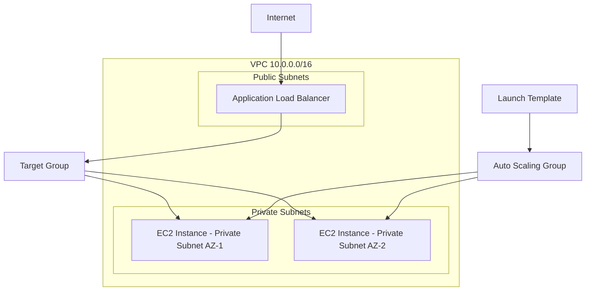

# Production AWS Infrastructure with Terraform

A production-style AWS infrastructure project built using Terraform with reusable modules, remote state, multi-AZ networking, an Application Load Balancer, and an Auto Scaling application tier.

The project demonstrates Infrastructure as Code practices including modular Terraform design, public/private subnet separation, layered security groups, remote state, health checks, Auto Scaling, and automatic failure recovery.

---

## Architecture



### Traffic Flow

```text
Internet
   |
   v
Application Load Balancer
   |
   v
Target Group
   |
   +----------+
   |          |
   v          v
EC2 #1      EC2 #2
Private     Private
AZ-1        AZ-2
```

The Application Load Balancer is internet-facing, while the application EC2 instances run only in private subnets.

---

## AWS Infrastructure

Terraform provisions:

- VPC with DNS support
- Two public subnets across multiple Availability Zones
- Two private subnets across multiple Availability Zones
- Internet Gateway
- Public and private route tables
- Application Load Balancer Security Group
- Private EC2 Security Group
- Application Load Balancer
- HTTP listener
- Target Group with health checks
- Amazon Linux 2023 Launch Template
- Auto Scaling Group
- Encrypted gp3 root EBS volumes
- S3 remote Terraform state with state locking

---

## Security Design

The application servers are not directly exposed to the internet.

```text
Internet
   |
   | TCP/80
   v
ALB Security Group
   |
   | TCP/80
   v
EC2 Security Group
```

The EC2 Security Group accepts HTTP traffic only from the Application Load Balancer Security Group.

Application EC2 instances:

```text
No public IPv4 address
No direct SSH access from the internet
Private subnet placement
HTTP access only from ALB
Encrypted root volumes
```

---

## Terraform Project Structure

```text
terraform-aws-production-infra/
|
|-- backend.tf
|-- providers.tf
|-- main.tf
|-- variables.tf
|-- outputs.tf
|-- terraform.tfvars.example
|-- .gitignore
|
`-- modules/
    |
    |-- network/
    |   |-- main.tf
    |   |-- variables.tf
    |   `-- outputs.tf
    |
    |-- security/
    |   |-- main.tf
    |   |-- variables.tf
    |   `-- outputs.tf
    |
    `-- compute/
        |-- main.tf
        |-- variables.tf
        `-- outputs.tf
```

### Network Module

Creates:

```text
VPC
Internet Gateway
Public Subnets
Private Subnets
Route Tables
Route Table Associations
```

### Security Module

Creates:

```text
ALB Security Group
EC2 Security Group
Security Group Rules
```

### Compute Module

Creates:

```text
Launch Template
Application Load Balancer
Target Group
Listener
Auto Scaling Group
```

---

## Remote State

Terraform state is stored remotely in Amazon S3.

Example backend configuration:

```hcl
terraform {
  backend "s3" {
    key          = "production/terraform.tfstate"
    use_lockfile = true
    encrypt      = true
  }
}
```

The S3 bucket is created separately during backend bootstrap and has:

```text
Versioning enabled
Public access blocked
Server-side encryption enabled
State locking enabled
```

---

## Deployment

Initialize Terraform:

```bash
terraform init \
  -backend-config="bucket=<STATE_BUCKET>" \
  -backend-config="region=ap-south-1"
```

Format:

```bash
terraform fmt -recursive
```

Validate:

```bash
terraform validate
```

Review the execution plan:

```bash
terraform plan
```

Deploy:

```bash
terraform apply
```

---

## Application Verification

Get the ALB DNS name:

```bash
terraform output -raw alb_dns_name
```

Test the application:

```bash
curl http://$(terraform output -raw alb_dns_name)
```

The response includes the hostname of the backend instance serving the request.

Running multiple requests demonstrates load balancing across EC2 instances.

---

## High Availability and Failure Recovery Test

The Auto Scaling Group is configured with:

```text
Minimum capacity : 2
Desired capacity : 2
Maximum capacity : 4
```

During testing, one running EC2 instance was manually terminated.

The Auto Scaling Group automatically:

```text
Detected the capacity loss
        |
        v
Launched a replacement instance
        |
        v
Applied the Launch Template
        |
        v
Registered the new instance with the Target Group
        |
        v
ALB health checks validated the application
        |
        v
New target became healthy
```

Application traffic continued through the remaining healthy instance during recovery.

---

## Key Terraform Concepts Demonstrated

```text
Infrastructure as Code
Reusable Terraform modules
Variables and outputs
Implicit dependencies
Lifecycle management
Dynamic AMI lookup
Remote state
State locking
Multi-AZ infrastructure
Infrastructure drift verification
Launch Templates
Auto Scaling integration
```

---

## Cost Considerations

This project can incur AWS charges while deployed, primarily from:

```text
Application Load Balancer
EC2 instances
EBS volumes
S3 backend usage
```

The lab intentionally does not use a NAT Gateway, RDS, Elastic IP, or Route 53 hosted zone to reduce cost.

Infrastructure should be destroyed after testing.

---

## Cleanup

Preview destruction:

```bash
terraform plan -destroy
```

Destroy infrastructure:

```bash
terraform destroy
```

Always verify that chargeable AWS resources have been removed after Terraform completes.

---

## Technologies

Terraform  
AWS VPC  
Amazon EC2  
Application Load Balancer  
Auto Scaling Groups  
Launch Templates  
Amazon S3  
AWS Systems Manager Parameter Store  
Git  
GitHub Codespaces
